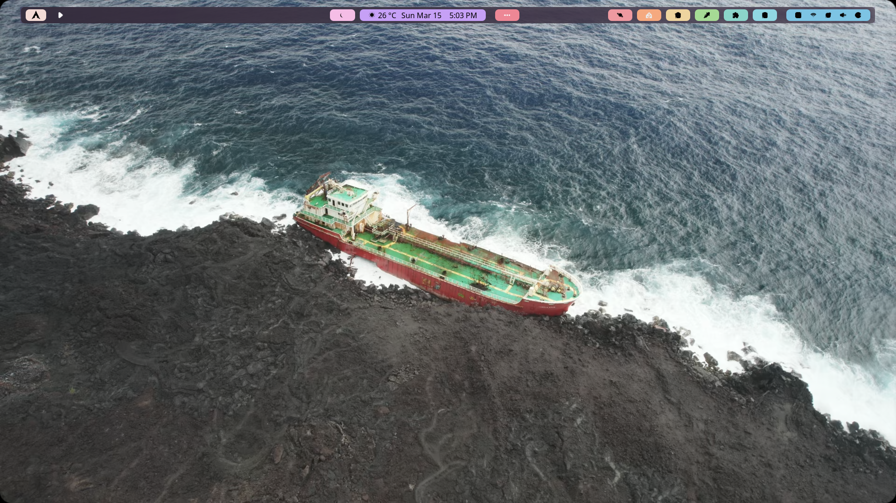
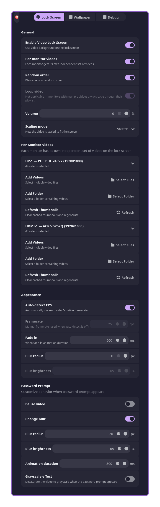
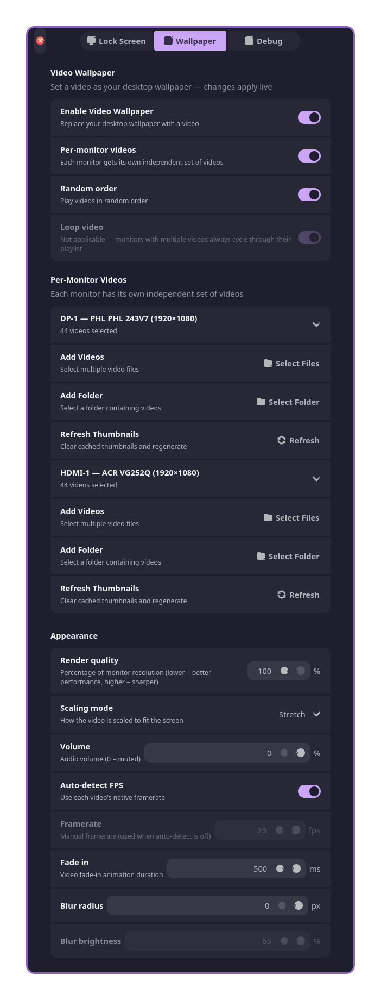
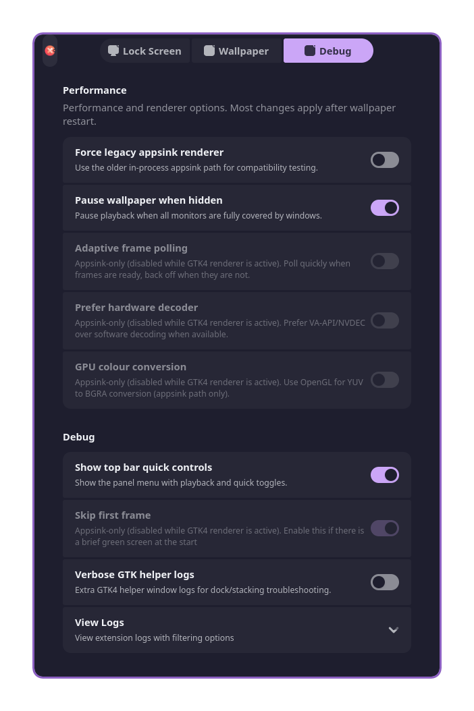
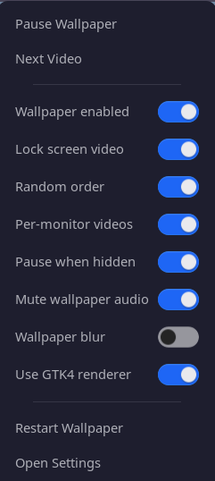

[](https://github.com/DeLuca21/LiveLockPaper)
[](https://github.com/DeLuca21/LiveLockPaper/releases)
[](https://github.com/DeLuca21/LiveLockPaper/issues)
[](https://extensions.gnome.org/)

---

<p align="center">
  
</p>

<h1 align="center">LiveLockPaper</h1>

<p align="center">
  A GNOME Shell extension that lets you set any video as your lock screen background <strong>and desktop wallpaper</strong> — with multi-video playlists, per-monitor support, auto FPS detection, and more.
</p>

<p align="center">
  <a href="https://ko-fi.com/DeLuca21" target="_blank">
    
  </a>
  <a href="https://buymeacoffee.com/DeLuca21" target="_blank">
    
  </a>
</p>

> **Note:** This is a fork of [Live Lock Screen](https://github.com/nick-redwill/LiveLockScreen) by [@nick-redwill](https://github.com/nick-redwill), extended with additional features. If you enjoy the core extension, consider [supporting the original author](http://buymeacoffee.com/nick_redwill) too.

---

## 🚀 What's New in v1.0.0

### ✅ Initial Release Highlights

- **GTK4 renderer by default** for high-performance video wallpaper and lock screen playback.
- **Video wallpaper + lock screen in one extension** with per-monitor playback support.
- **Stable multi-monitor behavior on Wayland**, including dock visibility after unlock.
- **Legacy appsink fallback in Debug settings** for compatibility testing and troubleshooting.
- **GStreamer init safety fix** using `Gst.init_check([])` for robust startup behavior.

### 🎬 Core Capabilities

- **🎥 Video Lock Screen + Desktop Wallpaper** — Use videos on lock screen and desktop.
- **🖥️ Per-Monitor Playback** — Assign videos per display with playlist support.
- **🎶 Multi-Video Playlists** — Add files/folders, then play sequentially or randomly.
- **📊 Auto FPS Detection** — Uses source framerate automatically for smoother playback.
- **🎨 Flexible Scaling** — Cover, fit, or stretch to match your layout.
- **🌫️ Blur + Prompt Effects** — Adjustable blur/brightness and password prompt behavior.
- **🔊 Optional Audio** — Volume control with fade-in/out support.
- **📑 Full Preferences UI** — Separate Lock Screen, Wallpaper, and Debug tabs.
- **📌 Top Bar Quick Controls** — Play/pause, next video, restart, settings, and quick toggles from the panel menu.
- **🖼️ Thumbnail + Metadata Tools** — Video previews, metadata display, and quick preview.
- **✅ Startup Validation** — Missing videos are removed automatically on startup.

---

## ⚙️ Default Setup (Fresh Install)

These defaults are aimed at sensible behavior out of the box:

- **Top bar quick-controls button:** enabled
- **Lock screen video:** enabled
- **Lock screen random order:** enabled
- **Lock screen auto FPS:** enabled
- **Change blur on password prompt:** enabled
- **Video wallpaper:** disabled (you can enable it any time)
- **Wallpaper random order:** enabled
- **Wallpaper auto FPS:** enabled
- **Wallpaper per-monitor mode:** enabled
- **Wallpaper render quality:** `90%`
- **Force legacy appsink renderer:** disabled (GTK4 renderer path remains default)
- **Pause wallpaper when hidden:** enabled

---

## 📸 Screenshots

<details>
  <summary><strong>Expand screenshots</strong></summary>
  <br>

  <p align="center"></p>
  <p align="center"></p>
  <p align="center"></p>
  <p align="center"></p>
  <p align="center"></p>
  <p align="center"></p>
  <p align="center"></p>
</details>

---

## 📥 Installation

### Manual Install (this fork)

1. Clone the repository:
   ```bash
   git clone https://github.com/DeLuca21/LiveLockPaper.git
   ```

2. Copy to your GNOME Shell extensions folder:
   ```bash
   cp -r LiveLockPaper ~/.local/share/gnome-shell/extensions/live-lockpaper@DeLuca21
   ```

3. Log out and back in (or restart GNOME Shell), then enable:
   ```bash
   gnome-extensions enable live-lockpaper@DeLuca21
   ```

4. Open the extension preferences and select your video files.

### Original Extension (GNOME Extensions)

The original (non-forked) version is available on the GNOME Extensions website:

<p align="center">
  <a href="https://extensions.gnome.org/extension/9419/live-lock-screen/">
    
  </a>
</p>

---

## 📦 Requirements

- **GNOME Shell 47–50**
- **GStreamer** with good/bad/ugly plugins
- **ffmpeg** (for thumbnail generation in preferences)

```bash
# Arch / Manjaro
sudo pacman -S gst-plugins-good gst-plugins-bad gst-plugins-ugly ffmpeg

# Fedora
sudo dnf install gstreamer1-plugins-good gstreamer1-plugins-bad-free gstreamer1-plugins-ugly ffmpeg

# Ubuntu / Debian
sudo apt install gstreamer1.0-plugins-good gstreamer1.0-plugins-bad gstreamer1.0-plugins-ugly ffmpeg
```

---

## 🧪 Renderer Notes (GTK4 vs Appsink)

- GTK4 (`gtk4paintablesink`) is the default renderer and is usually the most performant path.
- The Debug menu includes an option to force the legacy appsink renderer for comparison and troubleshooting.
- Some debug/performance toggles are appsink-only and are dynamically disabled while GTK4 mode is active.
- In multi-monitor wallpaper mode on Wayland, helper windows are kept internal and pinned for window-manager stability to keep the secondary-monitor dock visible after unlock.

---

## ⚠️ Known Issues

- Possible audio and video desync after suspend/wake.
- Brief green frame at video start — enable **"Skip first frame"** in Debug settings to fix.
- Possible clicking/crackling sounds when pausing/playing video with audio.
- Performance issues and shell crashes with high-res videos (hardware dependent).
- **Video wallpaper** uses GPU/CPU continuously — higher framerates and per-monitor mode use more resources.
- Most settings apply immediately; a few session-level changes may still need an extension reload.

---

## 🛠 Issues & Support

- Found a bug? Report it via [GitHub Issues](https://github.com/DeLuca21/LiveLockPaper/issues).
- Have a feature request? Feel free to suggest improvements.
- Pull requests are welcome!

---

## 🙏 Credits

LiveLockPaper is based on [Live Lock Screen](https://github.com/nick-redwill/LiveLockScreen) by [@nick-redwill](https://github.com/nick-redwill), with major extensions and ongoing maintenance for desktop wallpaper, multi-video workflows, and improved GNOME session behavior.

If you enjoy the base extension, please consider [supporting the original author](http://buymeacoffee.com/nick_redwill) 🍵

---

## Disclaimer

Some parts of this project were built with AI assistance, but all final code changes and release decisions are reviewed by me.
