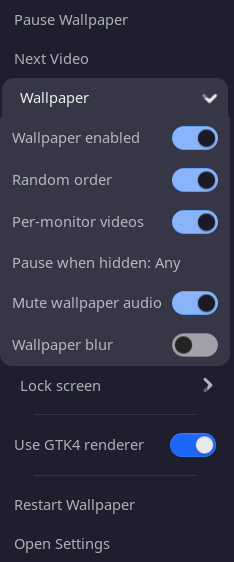
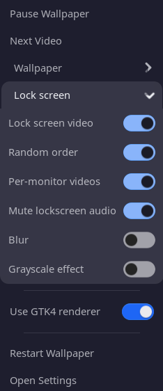

[](https://github.com/DeLuca21/LiveLockPaper)
[](https://github.com/DeLuca21/LiveLockPaper/releases)
[](https://github.com/DeLuca21/LiveLockPaper/issues)
[](https://extensions.gnome.org/)

---

<p align="center">
  
</p>

<h1 align="center">LiveLockPaper</h1>

<p align="center">
  A GNOME Shell extension that lets you set any video as your lock screen background <strong>and desktop wallpaper</strong> — with multi-video playlists, per-monitor support, auto FPS detection, and more.
</p>

<p align="center">
  <a href="https://ko-fi.com/DeLuca21" target="_blank">
    
  </a>
  <a href="https://buymeacoffee.com/DeLuca21" target="_blank">
    
  </a>
</p>

> **Note:** This is a fork of [Live Lock Screen](https://github.com/nick-redwill/LiveLockScreen) by [@nick-redwill](https://github.com/nick-redwill), extended with additional features. If you enjoy the core extension, consider [supporting the original author](http://buymeacoffee.com/nick_redwill) too.

---

## What's New in v4.0.0?

### ✨ Major additions

- **Redesigned preferences** — The old **single-sheet** GNOME-extension-style settings are replaced by a **full preferences app**: **Home**, **Library**, and **Settings** (libadwaita, multi-page layout, clearer structure).
- **Library** — New hub to **add files and folders**, manage **playlists**, browse **thumbnails and metadata**, and **apply** videos to the **lock screen** or **wallpaper** (including per-display assignment from the Library flow).
- **mpv renderer** — Third playback backend: **`mpv`** on `PATH` (`external/mpv_run.js`), per-monitor windows for lock screen and wallpaper, same helper command protocol as the GTK subprocess. Strong option for **4K** and heavy clips; uses **`--video-sync=display-resample`** and a larger demuxer buffer. Choose it under **Settings → Diagnostics → Performance → Video renderer** or from the **panel quick menu**. New **`video-renderer`** key (GTK4 default, **appsink**, **mpv**); legacy **`debug-use-gtk4-sink`** migrates on first load.

### 🐛 Fixes & reliability

- **Play counts** — Reworked tracking and reset for lock screen and wallpaper, including GTK4 helper paths.
- **Framerate vs GTK4** — Manual FPS and auto-FPS match the UI: with **auto off**, GTK4 and appsink use **GStreamer `videorate`**; with **auto on**, native timing per file.
- **Hardware decode** — **Prefer hardware decoder** raises VA-API/NVDEC ranks for the **GTK4 helper** and **appsink**, and drives **mpv `--hwdec`** when the mpv backend is active (defaults **on** for new installs).

### 🔧 Library & settings polish

- **Large libraries** — Chunked list builds, metadata detection, queued **ffmpeg** thumbnails (better for 4K/HEVC), thumbnails reattach after refresh. Prefs logs use **`[LLPrefs]`** when running **`gnome-extensions prefs live-lockpaper@DeLuca21`** from a terminal.
- **Destructive confirmations** — **Remove from library** and **Remove from folder/playlist** require confirmation (**Adw.AlertDialog**, same pattern as clearing thumbnails/metadata).

_Release notes for **v3.0.0** are in [Recent Updates](#recent-updates)._

---

## 🚀 Features

- **🎥 Video Lock Screen + Desktop Wallpaper** — Use videos on lock screen and desktop (GTK4, appsink, or **mpv** backend).
- **🖥️ Per-Monitor Playback** — Assign videos per display with playlist support.
- **🎶 Multi-Video Playlists** — Add files/folders, then play sequentially or randomly.
- **📚 Library (prefs)** — Browse the store with thumbnails and metadata; playlists; apply clips to lock screen or wallpaper from one place.
- **📊 Auto FPS + manual cap** — Auto follows each file’s native framerate; with auto off, manual FPS caps playback via GStreamer (`videorate`) on both GTK4 and appsink.
- **🎨 Flexible Scaling** — Cover, fit, or stretch to match your layout.
- **🌫️ Blur + Prompt Effects** — Adjustable blur/brightness and password prompt behavior (including grayscale option).
- **🔊 Optional Audio** — Volume control with fade-in/out support.
- **📑 Full Preferences UI** — **Home**, **Library**, and **Settings** (lock screen, wallpaper, diagnostics, and cache tools).
- **📌 Top Bar Quick Controls** — Play/pause, next video, restart, settings, and quick toggles from the panel menu.
- **🖼️ Thumbnail + Metadata Tools** — Video previews, metadata display, and quick preview.
- **✅ Startup Validation** — Missing videos are removed automatically on startup.
- **💤 Sleep/Wake Support** — Automatic pause/resume during system sleep and wake cycles.
- **🎨 Dynamic Panel Icons** — Panel icon automatically reflects current wallpaper/lockscreen state.
- **🔋 Battery Optimization** — Separate battery disable options for lockscreen and wallpaper to save power.

---

## ⚙️ Default Setup (Fresh Install)

These defaults are aimed at sensible behavior out of the box:

- **Top bar quick-controls button:** enabled
- **Panel icon mode:** Dynamic (standard GNOME icons)
- **Lock screen video:** enabled
- **Lock screen random order:** enabled
- **Lock screen auto FPS:** enabled
- **Lock screen customize text:** disabled
- **Lock screen command output command:** empty
- **Lock screen custom time/date formats:** empty (use GNOME defaults)
- **Lock screen keep awake:** disabled
- **Keep awake only on AC:** enabled
- **Keep awake timeout:** `Never`
- **Change blur on password prompt:** enabled
- **Grayscale prompt:** disabled
- **Lock screen disable on battery:** enabled (saves battery on laptops)
- **Video wallpaper:** disabled (you can enable it any time)
- **Wallpaper random order:** enabled
- **Wallpaper auto FPS:** enabled
- **Wallpaper per-monitor mode:** enabled
- **Wallpaper render quality:** `90%`
- **Wallpaper disable on battery:** enabled (saves battery on laptops)
- **Pause wallpaper when hidden:** Any monitor (pauses when any monitor is covered)
- **Video renderer (Diagnostics):** GTK4 subprocess (mpv and legacy appsink available there; install **mpv** for the mpv backend)
- **Force legacy appsink renderer (deprecated):** migrated into **video-renderer**; leave off unless upgrading old configs
- **Prefer hardware decoder:** enabled (GStreamer VA-API/NVDEC for GTK4 and appsink; **mpv `--hwdec`** when using mpv; disable if a video fails)
- **Verbose logging:** disabled (enable for troubleshooting)

---

## 📸 Screenshots

<details>
  <summary><strong>Expand screenshots</strong></summary>
  <br>

  <p align="center"></p>
  <p align="center"></p>
  <p align="center"></p>
  <p align="center"></p>
  <p align="center"></p>
  <p align="center"></p>
  <p align="center"></p>
  <p align="center"></p>
</details>

---

## 📥 Installation

### Manual Install (this fork)

1. Clone the repository:
   ```bash
   git clone https://github.com/DeLuca21/LiveLockPaper.git
   ```

2. Install into your GNOME Shell extensions folder:
   ```bash
   cp -r LiveLockPaper ~/.local/share/gnome-shell/extensions/live-lockpaper@DeLuca21
   ```
   Or move it instead of copying:
   ```bash
   mv LiveLockPaper ~/.local/share/gnome-shell/extensions/live-lockpaper@DeLuca21
   ```
   If you used `cp` and no longer need the clone directory:
   ```bash
   rm -rf LiveLockPaper
   ```

3. Log out and back in (or restart GNOME Shell), then enable:
  ```bash
   gnome-extensions enable live-lockpaper@DeLuca21
   ```

4. Open the extension preferences and select your video files.

### Original Extension (GNOME Extensions)

The original (non-forked) version is available on the GNOME Extensions website:

<p align="center">
  <a href="https://extensions.gnome.org/extension/9419/live-lock-screen/">
    
  </a>
</p>

---

## 📦 Requirements

- **GNOME Shell 47–50**
- **GStreamer** with good/bad/ugly plugins
- **ffmpeg** (for thumbnail generation in preferences)
- **mpv** (optional but recommended if you use the **mpv** renderer or want easier **4K** playback)

```bash
# Arch / Manjaro
sudo pacman -S gst-plugins-good gst-plugins-bad gst-plugins-ugly ffmpeg mpv

# Fedora
sudo dnf install gstreamer1-plugins-good gstreamer1-plugins-bad-free gstreamer1-plugins-ugly ffmpeg mpv

# Ubuntu / Debian
sudo apt install gstreamer1.0-plugins-good gstreamer1.0-plugins-bad gstreamer1.0-plugins-ugly ffmpeg mpv
```

---

## 🧪 Renderer Notes (GTK4, Appsink, mpv)

- **GTK4** (`gtk4paintablesink` in a subprocess) is the **default**. It is often efficient for **1080p**-class workloads.
- **Legacy appsink** runs **in-process** GStreamer into Clutter; use for comparison or if GTK4/mpv misbehave. **GPU colour conversion** and **adaptive frame polling** apply **only** when this renderer is selected (controls are insensitive for GTK4 and mpv).
- **mpv** uses **`mpv`** on `PATH` (one helper process, one window per monitor). Strong option for **4K** on many GPUs; install the distro **mpv** package. If **mpv** is missing, the extension falls back to another backend.
- **Prefer hardware decoder** boosts **GStreamer** decoder ranks for GTK4 and appsink; for **mpv** it toggles **`--hwdec`** (see Diagnostics copy).


## 🎨 Panel Icon Customization

The extension supports dynamic and static panel icons:

- **Dynamic (Standard Icons):** Uses standard GNOME icons that change based on wallpaper/lockscreen state
- **Dynamic (Custom Icons):** Uses custom icons from the `icons/` directory that change based on state
- **Static (Original Icon):** Always shows the original extension icon
- **Static (Custom Icon):** Always shows a custom icon from the `icons/` directory

For custom icons, place your icon files in the extension's `icons/` directory and configure the filenames in Debug settings.

## 💤 Sleep/Wake Behavior

The extension has been improved to better handle system sleep and wake cycles:

- **Lockscreen:** Video is destroyed on sleep and recreated on wake if the system is still locked (prevents blocking sleep)
- **Wallpaper:** Video is paused on sleep and resumed on wake when returning to desktop mode
- This prevents video playback from blocking system sleep and ensures proper behavior after wake

## ⏸️ Pause When Hidden Modes

The "Pause when hidden" feature now supports three modes:

- **Off:** Never pause wallpaper playback
- **All monitors:** Pause when all monitors are fully covered by fullscreen/maximized windows
- **Any monitor:** Pause when any monitor is fully covered by a fullscreen/maximized window

This helps save CPU/GPU resources when the wallpaper isn't visible.

---

## ⚠️ Known Issues

- Possible audio and video desync after suspend/wake (improved with sleep/wake handling).
- Brief green frame at video start — enable **"Skip first frame"** in Debug settings to fix.
- Possible clicking/crackling sounds when pausing/playing video with audio.
- Performance issues and shell crashes with high-res videos (hardware dependent).
- **Video wallpaper** uses GPU/CPU continuously — higher framerates and per-monitor mode use more resources. **4K at very high fps** (e.g. 120–240) may exceed hardware decode limits or stress the compositor; prefer **auto off + lower manual FPS**, **lower render quality**, **mpv** renderer, or **re-encoded** clips for wallpaper.
- Most settings apply immediately; a few session-level changes may still need an extension reload.
- Window positioning may need adjustment when settings window is on a different monitor (work in progress).

---

## Recent Updates

### What's New in v3.0.0?

- **Preferences reorganization** — Lock Screen, Wallpaper, and Debug pages use collapsed expanders for a more compact layout.
- **Keep Awake** — Configurable keep-awake behaviour for lock-screen playback workflows.
- **Lock screen text** — Richer controls for command output, time/date formatting, and styling.
- **Video list / layout** — Clearer buttons and icons in file and folder selection flows.
- **Expander rows** — Correct nested arrow visuals using default `Adw.ExpanderRow` behaviour.
- **Wallpaper prefs** — Initialization order fixes to avoid transient control sensitivity.
- **Clock / command output** — More consistent behaviour at minute rollover and faster refresh at hour boundaries.

---

## 🛠 Issues & Support

- Found a bug? Report it via [GitHub Issues](https://github.com/DeLuca21/LiveLockPaper/issues).
- Have a feature request? Feel free to suggest improvements.
- Pull requests are welcome!

---

## 🙏 Credits

LiveLockPaper is based on [Live Lock Screen](https://github.com/nick-redwill/LiveLockScreen) by [@nick-redwill](https://github.com/nick-redwill), with major extensions and ongoing maintenance for desktop wallpaper, multi-video workflows, and improved GNOME session behavior.

If you enjoy the base extension, please consider [supporting the original author](http://buymeacoffee.com/nick_redwill) 🍵

---

## Disclaimer

Some parts of this project were built with AI assistance, but all final code changes and release decisions are reviewed by me.
